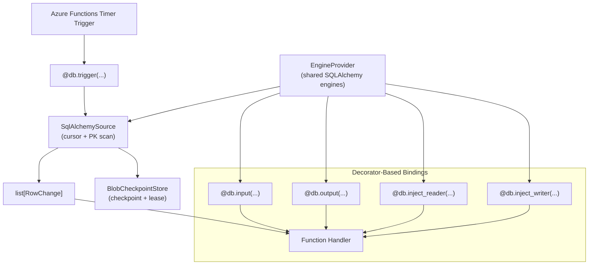

# DESIGN.md

Design Principles for `azure-functions-db`

## Purpose

This document defines the architectural boundaries and design principles of the project.

## Design Goals

- Provide poll-based change detection for SQL databases in Azure Functions Python v2.
- Offer decorator-based input/output bindings with predictable handler behavior.
- Normalize multi-database support through SQLAlchemy and focused driver extras.
- Keep trigger, binding, and shared engine lifecycle utilities cohesive but modular.

## Non-Goals

This project does not aim to:

- Replace Azure Functions scheduling, routing, or hosting behavior
- Implement a native C# database trigger extension for Azure Functions
- Hide SQL semantics behind a custom ORM or query language
- Own application-level retry orchestration, deployment, or infrastructure lifecycle

## Design Principles

- Poll-based trigger semantics must be explicit, observable, and at-least-once by default.
- Decorators should inject data or clients without changing core function semantics.
- Shared connection infrastructure (`DbConfig`, `EngineProvider`) should be reusable across bindings.
- Multi-database behavior should stay dialect-aware while preserving a single public API shape.
- Example applications should demonstrate supported production patterns, not internal shortcuts.

## Architecture

### Core Mechanism: Timer-Driven Polling + Decorator-Based Bindings

The architecture separates event detection (timer-triggered polling) from data access injection (input/output/client decorators). `SqlAlchemySource` tracks cursor-ordered changes from relational tables, `BlobCheckpointStore` persists progress and lease state, and `DbBindings` adapters inject rows, writers, or change batches into handlers. `EngineProvider` centralizes lazy SQLAlchemy engine reuse when trigger and bindings share database infrastructure.

Note: `@db.trigger(...)` is a pseudo-trigger and must be composed with a real Azure Functions trigger (typically `@app.schedule(...)`).

## Integration Boundaries

- OpenAPI document generation belongs to `azure-functions-openapi`.
- Runtime request/response validation belongs to `azure-functions-validation`.
- This repository owns poll-based DB trigger orchestration, DB input/output bindings, and shared SQLAlchemy engine/config primitives.

## Compatibility Policy

- Minimum supported Python version: `3.10`
- Supported runtime target: Azure Functions Python v2 programming model
- Public APIs follow semantic versioning expectations

## Change Discipline

- Trigger delivery semantics changes require explicit regression coverage and docs updates.
- Checkpoint/lease behavior changes are user-facing reliability changes and must be called out.
- New database dialect behavior must include tests and examples demonstrating expected parity.

## Sources

- [Azure Functions Python developer reference](https://learn.microsoft.com/en-us/azure/azure-functions/functions-reference-python)
- [Azure Functions timer trigger](https://learn.microsoft.com/en-us/azure/azure-functions/functions-bindings-timer)
- [SQLAlchemy Documentation](https://docs.sqlalchemy.org/)

## See Also

- [azure-functions-openapi — Architecture](https://github.com/yeongseon/azure-functions-openapi) - OpenAPI spec generation and Swagger UI
- [azure-functions-validation — Architecture](https://github.com/yeongseon/azure-functions-validation) - Request/response validation pipeline
- [azure-functions-logging — Architecture](https://github.com/yeongseon/azure-functions-logging) - Structured logging with contextvars
- [azure-functions-doctor — Architecture](https://github.com/yeongseon/azure-functions-doctor) - Pre-deploy diagnostic CLI
- [azure-functions-scaffold — Architecture](https://github.com/yeongseon/azure-functions-scaffold) - Project scaffolding CLI
