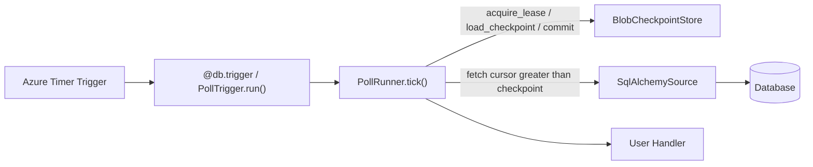

# ADR-001: Pseudo Trigger over Native Trigger

## Status
Accepted

## Context

In Azure Functions, HTTP and timer are built into the runtime; most other triggers/bindings are
provided via separate extension packages or extension bundles.
Building a new DB trigger as a general-purpose native extension carries very high initial and
ongoing maintenance cost.

## Decision

The MVP adopts a **pseudo trigger** model built on top of the Azure Functions native timer trigger.

## Rationale

- Can get started quickly with a Python-centric approach
- No need to write a .NET custom extension
- Easy to achieve broad DB compatibility
- High local reproducibility
- Delivery semantics can be controlled entirely within the library

## Consequences

Advantages:
- Fast implementation
- Easy debugging
- Wide DB reach

Disadvantages:
- Not real-time push
- Duplicates possible
- Limited delete detection

## Follow-up
Even if native capabilities are added for specific databases in the future, the public API will remain stable.

## Diagram

This decision means change detection runs as a timer-driven poll loop inside the
worker, rather than a host-managed native push trigger:

For the full step-by-step lifecycle (lease, checkpoint, fetch, commit ordering and
the at-least-once window) see the canonical
[Poll-trigger lifecycle diagram](02-architecture.md#trigger-flow-poll-based-change-detection).
