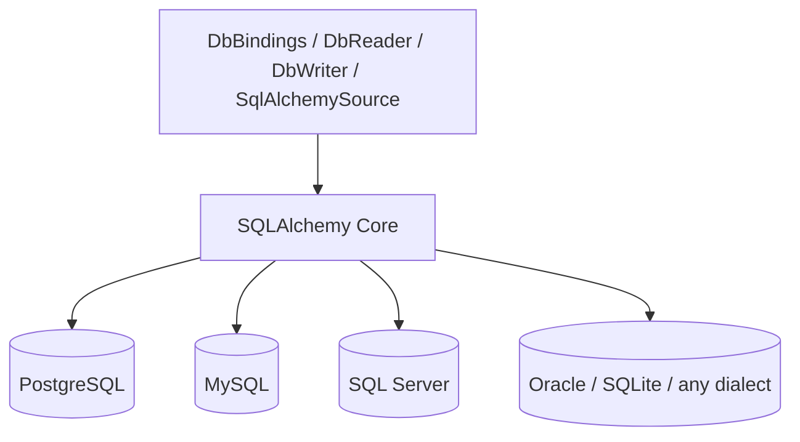

# ADR-002: SQLAlchemy-Centric Adapter Adoption

## Status
Accepted

## Context

To handle multiple RDBMSes through a common API, dialect/driver abstraction is required.
Building this from scratch would be prohibitively costly.

## Decision

The RDBMS MVP adopts an adapter based on SQLAlchemy Core.

## Rationale

- Broad dialect support: PostgreSQL / MySQL / SQLite / Oracle / SQL Server, etc.
- Hides DBAPI/driver differences cleanly
- Reflection, query builder, and parameter binding can be reused
- Can use Core alone without the ORM

## Alternatives
1. Direct per-DB raw driver support
2. ORM-centric design
3. Fully custom query layer

## Selection Rationale
SQLAlchemy Core offers the best balance among the alternatives.

## Consequences
- RDBMS reach achieved quickly
- Driver selection possible via package extras
- Non-SQL stores such as MongoDB maintain separate adapters

## Diagram

A single SQLAlchemy Core layer sits between the bindings/source and every supported
dialect, so the trigger and binding machinery never depends on a specific driver:

See the [Poll-trigger lifecycle diagram](02-architecture.md#trigger-flow-poll-based-change-detection)
for how `SqlAlchemySource.fetch()` fits into the polling loop.
